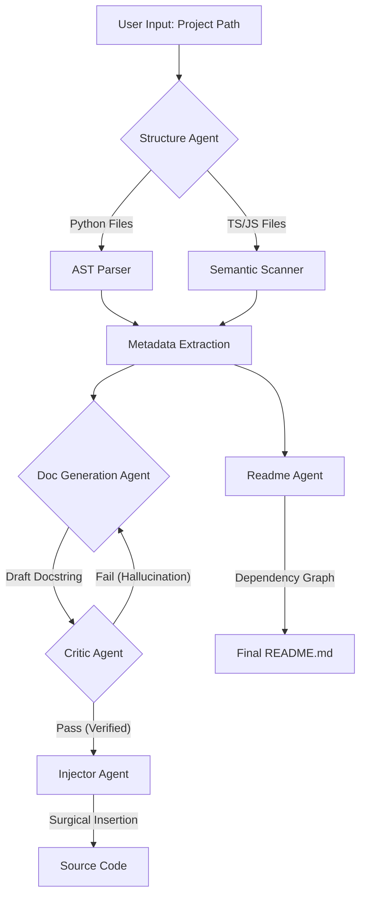

# 🤖 Nasiko-TLF: The Self-Reflective AI Documentation Agent

> **Automated. Intelligent. Self-Correcting.**
> *Built for the Nasiko Epoch X Hackathon.*

  

## 📖 Overview

**Nasiko-TLF** is a next-generation documentation engine that transforms raw code into professional, human-readable documentation. Unlike standard AI tools that blindly generate text, Nasiko uses a **Hybrid Intelligence Model** combining deterministic **AST analysis** with semantic **LLM reasoning** to ensure **0% hallucination** on function parameters.

It features a **Self-Reflection Loop** where a "Critic Agent" peer-reviews every docstring before it touches your code, ensuring only high-quality, accurate documentation is committed.

---

## 🚀 Key Innovations

### 1. 🧠 Hybrid Intelligence (AST + Gemini)
Most AI documentation tools guess parameters. Nasiko reads the **Abstract Syntax Tree (AST)** to extract the "Ground Truth" (real function names, arguments, return types) and uses Google Gemini only for the semantic description.
* **Result:** Accurate function signatures with creative, context-aware explanations.

### 2. 🛡️ The Self-Reflection Loop (Critic Agent)
Nasiko implements an internal quality gate.
1.  **Generator:** Writes a draft docstring.
2.  **Critic:** Reviews the draft against the AST metadata.
3.  **Refiner:** If the Critic spots a hallucination or missing arg, it forces the Generator to rewrite it.
* *It fixes its own mistakes before you ever see them.*

### 3. 🌐 Multi-Stack Adaptability
Nasiko detects your tech stack automatically:
* **Python:** Generates **Google Style** docstrings (`"""`).
* **TypeScript/React:** Generates **JSDoc** comments (`/** */`) using semantic regex scanning.
* **Architecture:** Reverse-engineers your project structure into a live **Mermaid.js** diagram.

---

## 🏗️ Architecture

Nasiko operates via a multi-agent orchestration pipeline:



---

## 📦 Installation

### Prerequisites

* Python 3.8+
* A Google Gemini API Key

1. **Clone the Repository**
```bash
git clone [https://github.com/Faham-from-nowhere/nasiko_agent.git](https://github.com/Faham-from-nowhere/nasiko_agent.git)
cd nasiko_agent

```


2. **Install Dependencies**
```bash
pip install google-generativeai networkx python-dotenv

```


3. **Configure API Key**
Create a `.env` file in the root directory:
```env
GEMINI_API_KEY=your_google_gemini_key_here

```


---

## ⚡ Usage

Run the agent on any project folder. It handles deeply nested directories, ignores build artifacts (like `node_modules`), and adapts to the language it finds.

```bash
# Run on a specific project path (supports spaces in quotes)
python main.py "D:\Path\To\Your\Project"

```

**What happens next?**

1. **🔍 Scanning:** The agent maps your entire codebase, skipping junk folders like `.next` or `venv`.
2. **⚙️ Generating:** It writes docstrings for every function/component using **Role-Based Prompting**.
3. **🛡️ Critiquing:** You will see logs like `⚠️ Critique: Missing param 'user_id'. Refining...` as it self-corrects.
4. **📚 Synthesizing:** It generates a `README_AI.md` with a visual architecture graph of your project.

---

## 📂 Project Structure

| Module | Description |
| --- | --- |
| **`main.py`** | The CLI entry point that orchestrates the agent workflow. |
| **`agents/structure_agent.py`** | The "Eyes." Scans files, parses AST, and builds the dependency graph. |
| **`agents/doc_agent.py`** | The "Writer." Generates context-aware documentation using Gemini. |
| **`agents/critic_agent.py`** | The "Judge." Validates output against ground truth metadata. |
| **`agents/readme_agent.py`** | The "Architect." Synthesizes the project-level documentation. |
| **`core/injector.py`** | The "Surgeon." Safely inserts docstrings without breaking code indentation. |

---

## ⚠️ Assumptions & Limitations

* **API Limits:** Rate limits apply on the Gemini Free Tier. The agent includes a retry mechanism (`time.sleep`) to mitigate `429` errors.
* **JSDoc Parsing:** TypeScript support uses Regex for speed and robustness on large projects, rather than a full AST parser.
* **UTF-8:** The system enforces UTF-8 encoding to prevent Windows `charmap` errors with emoji/special characters.

---

*Built with ❤️ for the Nasiko Epoch X Hackathon.*

```

```